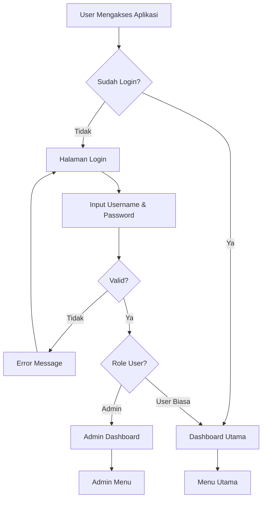
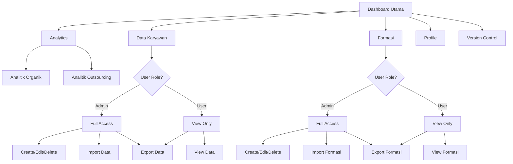
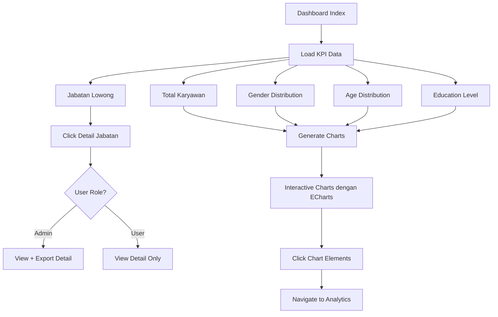
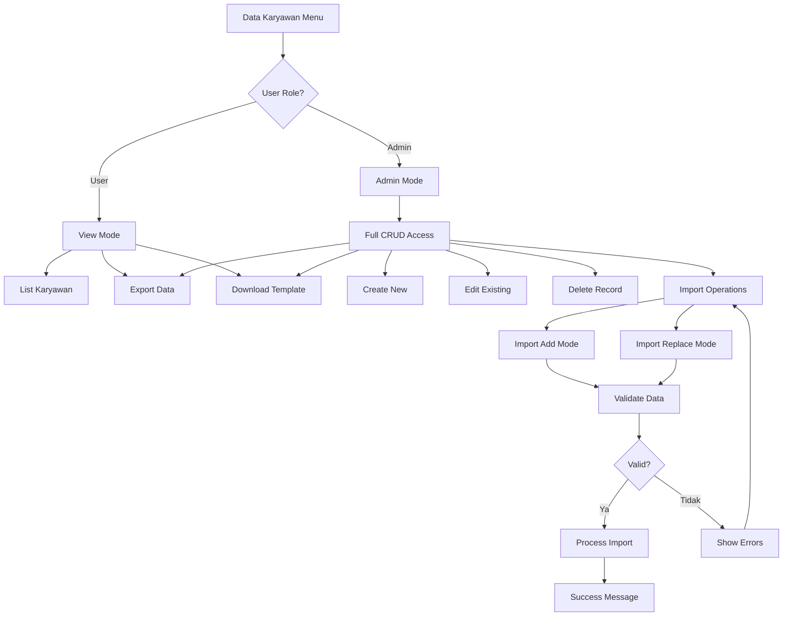
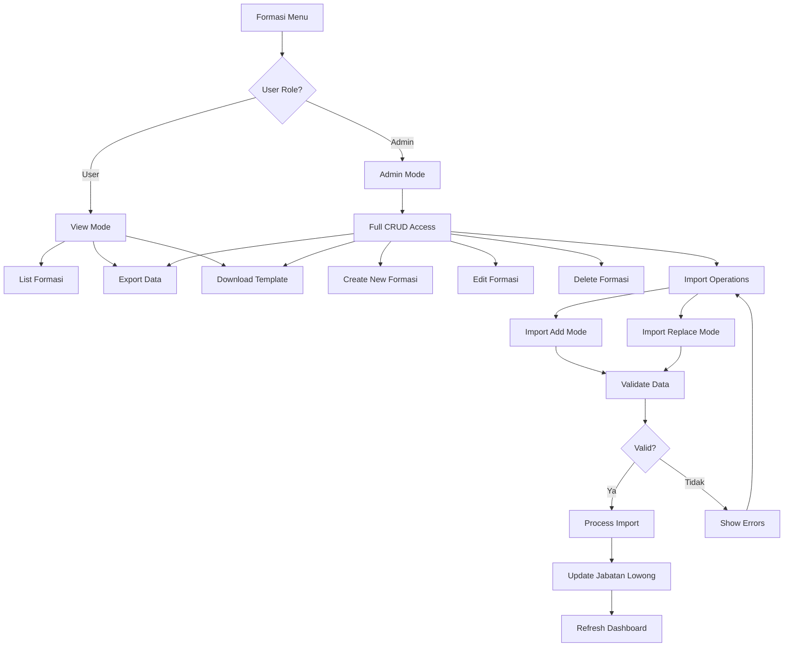
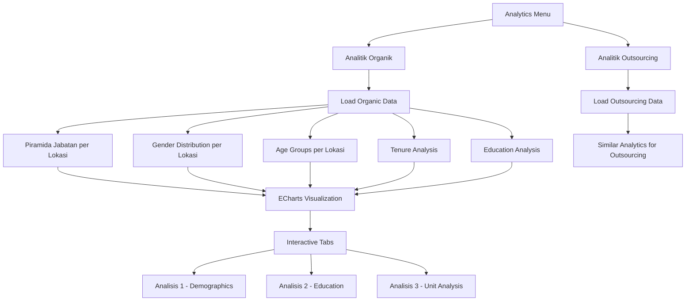
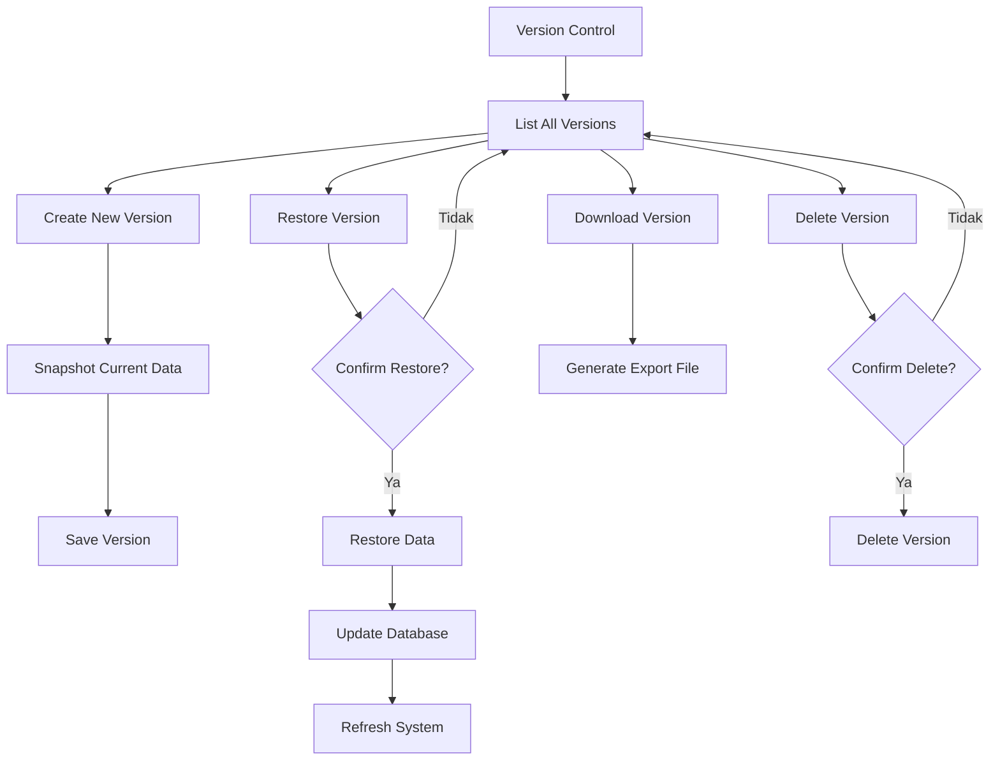
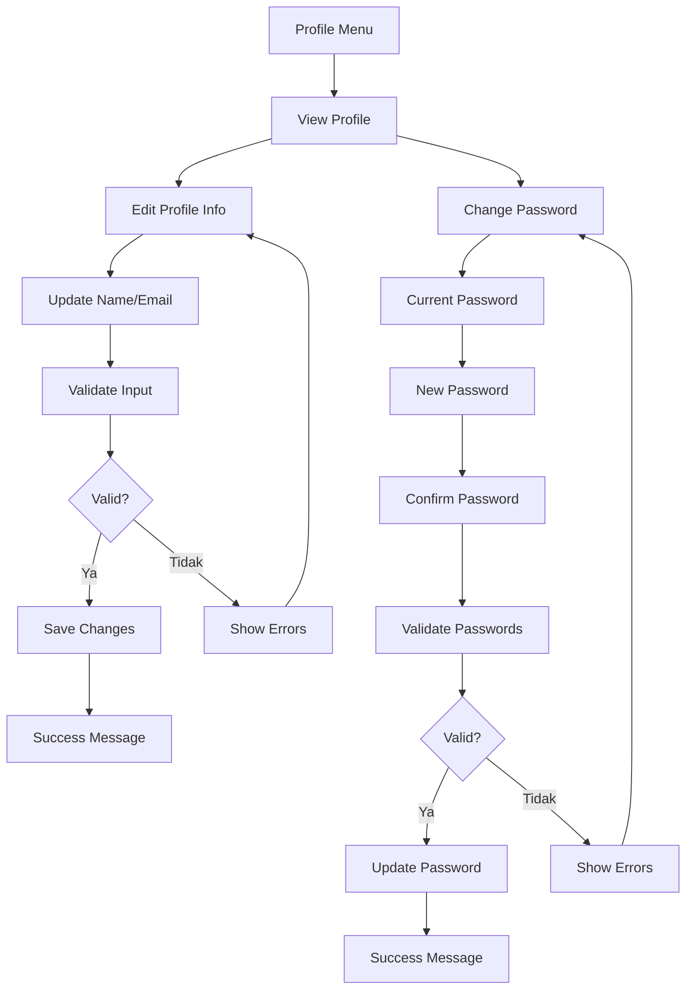
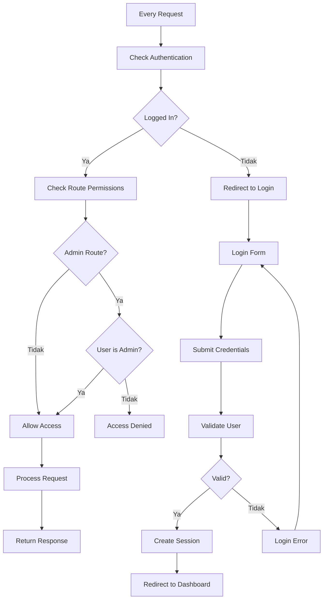
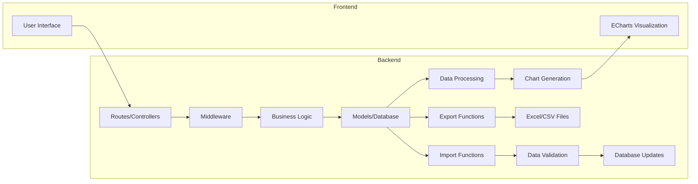

# Flowchart Sistem DBHC (Dashboard Kepegawaian Regional 1 PT Angkasa Pura Indonesia)

## 1. Alur Utama Sistem

## 2. Struktur Menu dan Hak Akses

## 3. Alur Detail Dashboard

## 4. Alur Data Karyawan Management

## 5. Alur Formasi Management

## 6. Alur Analytics System

## 7. Alur Version Control

## 8. Alur Profile Management

## 9. Security & Authentication Flow

## 10. Data Flow Architecture

## Penjelasan Sistem:

### **Karakteristik Utama:**
1. **Role-based Access Control**: Admin vs User biasa
2. **Dashboard Interaktif**: Charts dengan ECharts
3. **Data Management**: CRUD operations untuk Karyawan & Formasi  
4. **Analytics**: Detailed analysis untuk Organik vs Outsourcing
5. **Version Control**: Snapshot dan restore data
6. **Import/Export**: Excel/CSV processing
7. **Security**: Authentication & authorization layers

### **User Roles:**
- **Admin**: Full access - CRUD, Import, Export, Delete
- **User**: Read access - View, Export only

### **Core Features:**
- Dashboard dengan KPI dan charts interaktif
- Management data karyawan dan formasi
- Analytics mendalam (organik vs outsourcing)
- Version control untuk data backup/restore
- Profile management
- Secure authentication system